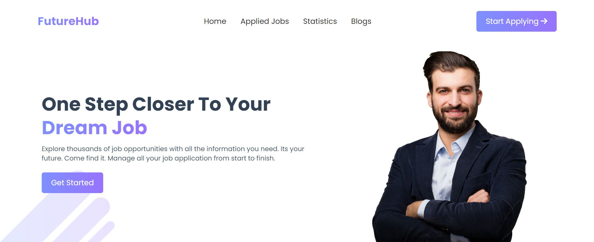

<h3>Project: FutureHub</h3>

It works like a job application website made by React

<h4>Features:</h4>
<ul type="square" style="display:flex; gap:5px;">
  <li>It's link works dynamically doesn't load this website</li>
  <li>If click job "view details" button then see that job deetails</li>
  <li>After seeing job details then if click "Apply Now" then toast show dynamically if already clicked apply now button then toast show "Already Submitted" or if click first time then toast show "Submit Done</li>
  <li>Used Browser localstorage for save applied jobs details</li>
  <li>Used Rechart in statistic page</li>
  <li>Website totally mobile, tablet, monitor responsive</li>
</ul>
<b>Live Link: <a href="https://quiet-froyo-954e47.netlify.app/">Live Link</a><b>

 

